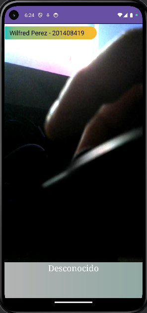
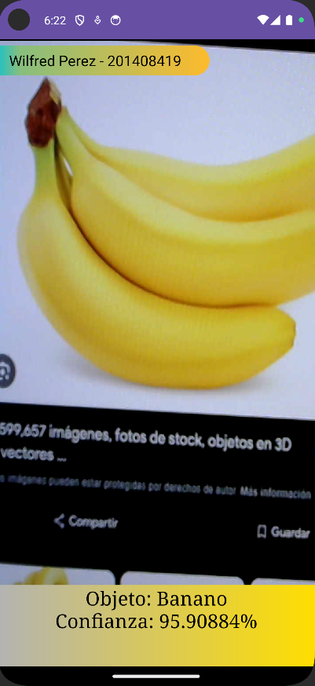
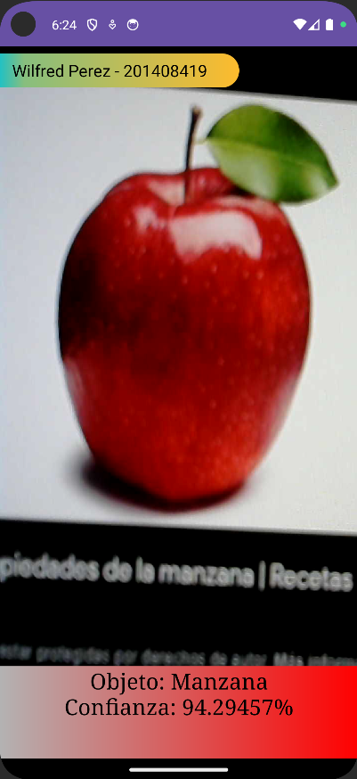

# Wilfred Stewart Perez Solorzano
# 201408419
# Grupo 25

# Manual de Usuario - Aplicación de Reconocimiento de Frutas

## Índice

- [Introducción](#introducción)
- [Cómo usar la aplicación](#cómo-usar-la-aplicación)
- [Funciones Principales](#funciones-principales)
- [Solución de Problemas](#solución-de-problemas)
- [Contacto y Soporte](#contacto-y-soporte)

## Introducción

Esta aplicación utiliza la cámara de tu dispositivo Android para reconocer manzanas y bananos en tiempo real. Utiliza tecnología de visión por computadora y aprendizaje automático para identificar estas frutas de manera eficiente y precisa.

## Cómo usar la aplicación

### Iniciar la Aplicación

1. Toca el ícono de **Reconocimiento de Frutas** en tu pantalla de inicio o menú de aplicaciones.
2. Concede los permisos necesarios para acceder a la cámara.

### Reconocimiento de Frutas

1. Apunta la cámara hacia una manzana o un banano.
2. La aplicación identificará la fruta en tiempo real y mostrará el nombre en la pantalla.
3. Puedes capturar la imagen si lo deseas, tocando el botón de captura.

### Objetivo desconocido

### Objetivo banana

### Objetivo Manzana

## Funciones Principales

- **Reconocimiento en Tiempo Real**: Identifica manzanas y bananos instantáneamente.
- **Captura de Imágenes**: Permite guardar las imágenes de las frutas reconocidas.
- **Información Nutricional**: Proporciona datos sobre las frutas identificadas.

## Solución de Problemas

- **La aplicación no reconoce la fruta**: Asegúrate de que la fruta esté bien iluminada y dentro del marco de la cámara.
- **La aplicación no se abre**: Verifica que tu dispositivo tenga la última versión del sistema operativo Android.

## Contacto y Soporte

Si tienes preguntas o necesitas ayuda, contáctanos a través de:

- **Email**: wilfredp159@gmail.com
- **Teléfono**: +502 50723395

